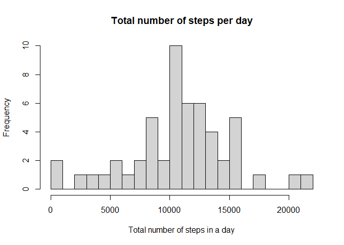
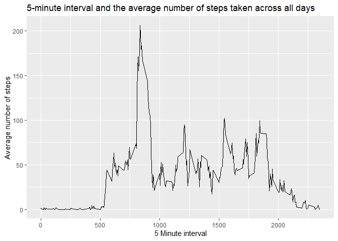
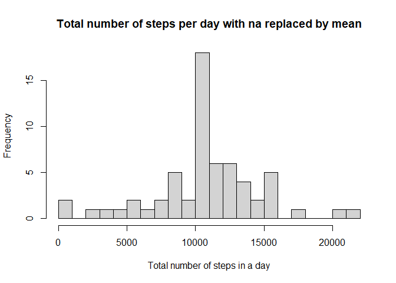
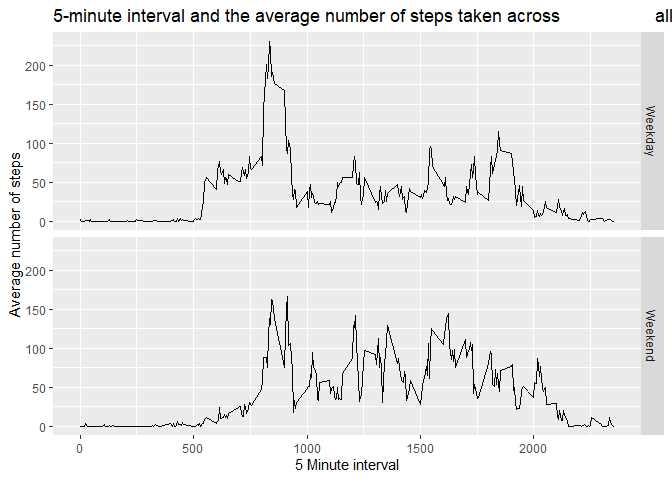

### Loading and processing the data
Read the file and save it to data and remove NA values

```r
data <- read.csv("repdata_data_activity/activity.csv", sep = ",")
stepdata <- data[!is.na(data$steps),]
```

### What is mean total number of steps taken per day?
Compute the sum of steps for each date

```r
steps_per_day <- aggregate(formula = steps ~ date, data = stepdata, FUN = sum)
```

Create a histogram of number of steps each day

```r
hist(steps_per_day$steps, main="Total number of steps per day", 
     xlab="Total number of steps in a day", breaks = 20)
```

<!-- -->

Calculate mean and median of total number of steps per day

```r
summary(steps_per_day$steps)
```

```
##    Min. 1st Qu.  Median    Mean 3rd Qu.    Max. 
##      41    8841   10765   10766   13294   21194
```

```r
avg <- mean(steps_per_day$steps)
med <- median(steps_per_day$steps)
```

### What is the daily average activity pattern?


```r
library(ggplot2)
avg_interval_step <- aggregate(formula = steps ~ interval, data = stepdata, FUN = mean)
ggplot(avg_interval_step, aes(interval, steps)) + geom_line() + xlab("5 Minute interval") + ylab("Average number of steps") + ggtitle("5-minute interval and the average number of steps taken across all days")
```

<!-- -->


Find the max 5 minute interval with maximum average steps


```r
max_row <- which.max(avg_interval_step$steps)

avg_interval_step[max_row,]
```

```
##     interval    steps
## 104      835 206.1698
```

### Inputting missing values


```r
nbr_missing <- sum(is.na(data))
```
Number of missing values are 2304

Replace the missing values with the mean for that interval


```r
# missing_data <- data[is.na(data),]
new_data <- data
for (i in 1:nrow(new_data)){
        if (is.na(new_data$steps[i])){
                interval_val <- new_data$interval[i]
                row_i <- which(avg_interval_step$interval == interval_val)
                steps_val <- avg_interval_step$steps[row_i]
                new_data$steps[i] <- steps_val
        }
}
```


Histogram of the new data

```r
new_steps_per_day <- aggregate(formula = steps ~ date, data = new_data, FUN = sum)
hist(new_steps_per_day$steps, main="Total number of steps per day with na replaced by mean", 
     xlab="Total number of steps in a day", breaks = 20)
```

<!-- -->


```r
summary(new_steps_per_day$steps)
```

```
##    Min. 1st Qu.  Median    Mean 3rd Qu.    Max. 
##      41    9819   10766   10766   12811   21194
```

The results only differ in the median and not in the mean.This was due to removing the na values for the first analysis and therefore the median can be affected by adding new mean values to the table. Also the distribution changed.

The impact will be that the data will be biased towards the mean and if there was an underlying bias causing higher frequency of the mean to begin with it will become worse.

### Create a new factor variable


```r
day_vec <- weekdays(as.Date(new_data$date))
new_data$weekday <- NA
for (i in 1:nrow(new_data)) {
        if (day_vec[i] %in% c("Saturday", "Sunday")) {
                new_data[i,]$weekday <- "Weekend"
        } else {
                new_data[i,]$weekday <- "Weekday"
        }
}
new_avg_interval_step <- aggregate(formula = steps ~ interval+weekday, data = new_data, FUN = mean)
(ggplot(new_avg_interval_step, aes(interval, steps)) 
        + geom_line() + xlab("5 Minute interval") 
        + ylab("Average number of steps") 
        + ggtitle("5-minute interval and the average number of steps taken across                   all days")
        + facet_grid(rows = vars(weekday)))
```

<!-- -->
